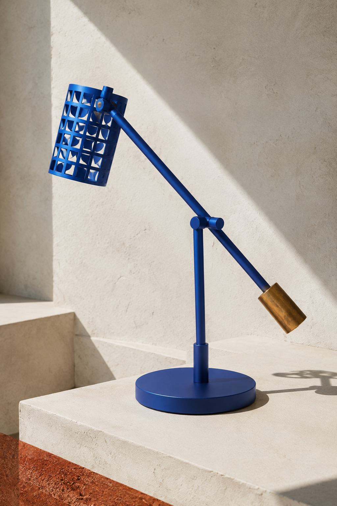
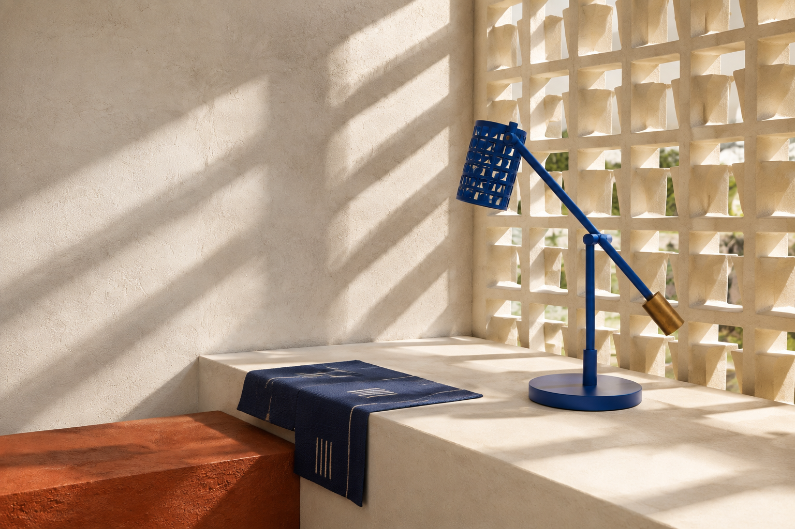

# Iterum designer-first demo runbook

Use this runbook to rehearse, test, and record one complete Iterum campaign. No WebMCP knowledge is required. Follow the numbered steps in order, copy the supplied message into ChatGPT, check the result on screen, and make the named designer decision.

Technical tool sequences and payload rules are kept in the operator appendix. During the video, keep attention on the creative work and reveal tool mechanics only when they prove an important boundary such as approval, cost, provenance, or recovery.

## The story in one sentence

> A graphic designer directs ChatGPT through a professional campaign workflow while Iterum turns each request into reviewable WebMCP actions—and the designer decides what becomes part of the campaign.

## Demo campaign

| Field | Direction |
| --- | --- |
| Campaign | Signal Relay |
| Product | Fictional cobalt modular task lamp informed by contemporary West African modernism |
| Working line | Light becomes a modular signal. |
| Audience | Architects and design-literate lighting buyers |
| Proposition | A compact light turns material, ventilation, and shadow into spatial rhythm. |
| Tone | Precise, sun-cut, tactile, architectural |
| Lead route | Signal Relay / Cobalt Courtyard |
| Visual thesis | A cobalt object becomes an architectural signal among chalk plaster, perforated shade, indigo, bronze, and laterite. |
| Image treatment | Hard equatorial light, crisp perforated shadows, mineral surfaces, restrained editorial grain |
| Type direction | Condensed grotesk display with monospaced technical captions |
| Palette | Cobalt `#073B9A`, chalk `#F1E8D5`, carbon `#171717`, laterite `#A94E2F`, bronze `#B47A2A` |

This campaign must look visibly unrelated to the Static Bloom fragrance fixture. That difference proves Iterum can begin with a blank project rather than restyling seeded content.

## How to use this runbook

For every numbered step:

1. Copy the message under **Say to ChatGPT**.
2. Wait for ChatGPT to finish using Iterum.
3. Compare the screen with **Look for**.
4. Complete the **Designer decision** yourself. ChatGPT must not approve creative work for you.

If a result is wrong, stop at that step and ask ChatGPT to correct it. Do not continue with bad IDs, missing approvals, or a direction you would not actually choose.

## Before you begin

1. Use ChatGPT with the in-app browser enabled.
2. Keep direct placement disabled so every agent-found or generated item enters Review.
3. Use a 1440×960 or larger window at 100% browser zoom.
4. Use one low-quality image during rehearsal. Use medium quality only for the final take if the added cost and wait are acceptable.

Use these original fictional client assets. They were generated specifically for the Iterum demo and share one contemporary West African modernist design language:

| Asset | What it contributes | Production URL |
| --- | --- | --- |
| Cobalt lamp | Product identity, perforated shade, cobalt and bronze materials | `https://iterum-topaz.vercel.app/assets/signal-relay-cobalt-lamp-v1.png` |
| Shadow study | Breeze-block rhythm, hard light, chalk plaster, laterite | `https://iterum-topaz.vercel.app/assets/signal-relay-shadow-study-v1.png` |
| Architectural still life | Spatial composition, indigo textile, negative space, material palette | `https://iterum-topaz.vercel.app/assets/signal-relay-architectural-still-life-v1.png` |

The production URLs become available after this branch is deployed. For a local rehearsal, replace `https://iterum-topaz.vercel.app` with `http://127.0.0.1:3333`.

### Asset preview

**1. Cobalt lamp — product identity**



**2. Perforated shadow — light and material**


**3. Architectural still life — composition and atmosphere**



## The designer workflow

### Step 1 — Open Iterum

**Goal:** Put ChatGPT and Iterum in the same WebMCP-capable browser session.

**Say to ChatGPT:**

> Open https://iterum-topaz.vercel.app/projects in the in-app browser. Wait for the Projects page to load. Confirm that it says “Private cloud connected” and “WebMCP ready.” Do not create or change anything yet.

**Look for:**

- The Iterum Projects page is visible in the in-app browser.
- **Private cloud connected** and **WebMCP ready** are present.
- ChatGPT confirms that it can see Iterum’s tools.

**Your decision:** If either status is missing, stop and fix the connection before continuing.

### Step 2 — Start with a blank campaign

**Creative goal:** Prove that the direction is not inherited from another board.

**Say to ChatGPT:**

> We are launching a cobalt modular task lamp informed by contemporary West African modernist architecture and material craft. Start a new campaign called Signal Relay. Do not reuse anything from the fragrance campaign or any previous project.

**Do not add images yet.** This step creates the empty campaign container only. You will add the three images in Step 4, after you review and lock the brief.

**Look for:**

- A new cloud project opens.
- The board contains no old references, routes, palettes, type specimens, or applications.
- The workspace reports a cloud-ready or saved state.

**Designer decision:** Confirm that the project is genuinely blank before continuing.

### Step 3 — Turn the assignment into a clear brief

**Creative goal:** Define what the work must communicate before collecting images.

**Say to ChatGPT:**

> Structure the brief for architects and design-literate lighting buyers. The proposition is that a compact light turns material, ventilation, and shadow into spatial rhythm. The visual context is contemporary West African modernism: chalk plaster, perforated screens, indigo, bronze, laterite, and hard equatorial light. Keep it precise, sun-cut, tactile, and architectural. The cobalt lamp is mandatory. Avoid generic “African” decoration, copied ceremonial motifs, masks, flags, safari imagery, lifestyle clutter, luxury gradients, and rendered campaign typography.

**Look for:**

- Audience, proposition, tone, mandatories, and anti-directions are explicit.
- The brief remains editable.
- ChatGPT asks the designer to lock it rather than locking it automatically.

**Designer decision:** Read it, correct anything vague, then click **Save + lock**.

Ask yourself: *Does this brief give me enough tension to judge later work?*

### Step 4 — Protect the client material

**Creative goal:** Establish the non-negotiable product and the visual evidence supplied by the client.

**Say to ChatGPT:**

> Add the following three fictional client-supplied images to Review. They were generated for this Iterum demo. Preserve each origin URL and label its attribution “Original Iterum demo asset.” Treat the cobalt lamp as mandatory. Do not place any image directly on the board.
>
> 1. Cobalt lamp — product identity: https://iterum-topaz.vercel.app/assets/signal-relay-cobalt-lamp-v1.png
> 2. Perforated shadow — light and material: https://iterum-topaz.vercel.app/assets/signal-relay-shadow-study-v1.png
> 3. Architectural still life — composition and atmosphere: https://iterum-topaz.vercel.app/assets/signal-relay-architectural-still-life-v1.png

**Look for:**

- Three cards appear in Review before they appear on the board.
- Every card shows source, attribution, rights, rationale, crop, and intended territory.
- The product shot is identified as a mandatory asset.

**Designer decision:** Approve the three valid client references. Reject any duplicate or incorrectly described card.

Ask yourself: *What specific job does each image perform?* A reference without a job is clutter.

### Step 5 — Explore three genuinely different worlds

**Creative goal:** Avoid committing to the first visually plausible answer.

**Say to ChatGPT:**

> Build three distinct campaign routes from the approved material. Route A, Cobalt Courtyard, should treat the lamp as a blue architectural signal in chalk space. Route B, Indigo Grid, should focus on perforated repetition, woven line, and shadow rhythm. Route C, Laterite Interval, should use an earthen red plane and bronze as spatial interruptions. Give each route one thesis, an image treatment, a type direction, a palette, and composition principles. Keep the references contemporary and specific; do not introduce generic “African” motifs.

**Look for:**

| Route | What should make it distinct |
| --- | --- |
| Cobalt Courtyard | Cobalt object, chalk space, breeze-block rhythm, hard diagonal shadow |
| Indigo Grid | Perforation, woven line, measured repetition, kinetic cropping |
| Laterite Interval | Mineral neutral field interrupted by laterite red and bronze |

**Designer decision:** Reject the weakest route with a clear reason. Approve **Signal Relay** as the lead only if it is the clearest answer to the brief.

Ask yourself:

- *Can I identify each route without reading its title?*
- *Does each route answer the same brief in a meaningfully different way?*
- *Which route has enough range to become a campaign rather than one attractive image?*

### Step 6 — Edit the board into a hierarchy

**Creative goal:** Turn collected material into an argument, not a tidy grid.

**Say to ChatGPT:**

> Organize the approved Signal Relay material by contribution and visual weight. Keep protected references untouched. I want one hero idea, two or three supporting references, and short notes explaining what each contributes. Show me the proposed hierarchy before moving anything.

**Look for:**

- A preview appears before canonical positions change.
- One item is clearly dominant.
- Supporting items explain material, light, rhythm, or composition.
- Locked references remain untouched.
- Notes describe contribution rather than merely labeling content.

**Designer decision:** Remove anything redundant. Approve the Direction Draft only when the eye knows where to begin and where to go next.

Ask yourself: *If I remove one reference, does the story become clearer?* If yes, remove it.

### Step 7 — Build the type relationship

**Creative goal:** Give the campaign a deliberate voice and scale contrast.

**Say to ChatGPT:**

> Find an open-source condensed display face and a restrained monospaced caption face. Commercial typefaces may appear only as reference recommendations. Show the line “Light becomes a modular signal” as a live specimen and propose a clear display-to-caption scale relationship.

**Look for:**

- Typeface source and license are visible.
- Commercial faces are labeled reference-only.
- The specimen uses live type, not raster text.
- Headline and caption roles are obvious at a glance.

**Designer decision:** Approve the pairing only if it feels architectural without becoming a generic tech brand. The stable fallback is **Barlow Condensed + IBM Plex Mono**.

Ask yourself: *Does the type create the intended pressure even without the photography?*

### Step 8 — Assign color roles

**Creative goal:** Convert sampled color into a usable campaign system.

**Say to ChatGPT:**

> Keep cobalt as the primary signal. Propose a restrained role-based palette using chalk as the ground, carbon for type, laterite as the secondary accent, and bronze as a material highlight. Show alternatives, but do not pin anything for me.

**Look for:**

- Suggested colors remain proposals.
- Colors are named by use, not just listed as swatches.
- Cobalt remains dominant; laterite and bronze remain accents.

**Designer decision:** Pin only:

- Ground: `#F1E8D5`
- Primary signal: `#073B9A`
- Type: `#171717`
- Secondary accent: `#A94E2F`
- Material highlight: `#B47A2A`

Ask yourself: *Could another designer apply these colors consistently without guessing?*

> Current limitation: `extract_reference_palette` accepts Iterum-local relative images. Do not claim that it extracted these public HTTPS demo assets. Use palette suggestions for this recording or extend the extractor first.

### Step 9 — Generate one missing campaign image

**Creative goal:** Create new visual material that follows the approved route instead of copying a reference.

**Say to ChatGPT:**

> Using the approved Cobalt Courtyard route and approved cobalt product reference, generate one square editorial product-image study. Put the lamp on a chalk-plaster architectural plinth with a perforated screen, hard equatorial afternoon light, and one long diagonal shadow. Preserve the cobalt color, perforated shade, silhouette, bronze counterweight, and modular construction. Avoid words, logos, people, clutter, gradients, masks, flags, safari imagery, and copied ceremonial motifs. Leave clear space on the upper left for live typography.

**Look for before generation:**

- Iterum shows the model, quality, image count, estimated output cost, excluded input cost, and an exact quote fingerprint.
- Nothing is generated yet.

**Designer decision:** If the disclosure is acceptable, say:

> I approve this exact disclosed cost for one low-quality candidate.

**Look for after generation:**

- The image enters Review, not the board.
- The card says **Generated study**, not sourced reference.
- Model, version, run key, dimensions, rights status, and lineage are visible.
- The image is absent from Present mode while pending.

Do not approve it immediately. Ask yourself:

- *Does it preserve the product?*
- *Does it express the chosen route?*
- *Is there genuinely usable space for live typography?*
- *Does it add something the source references did not already provide?*

### Step 10 — Make a purposeful revision

**Creative goal:** Demonstrate art direction, not one-shot generation.

**Say to ChatGPT:**

> Create a new version. Keep the lamp unchanged, make the shadow longer and slightly sharper, and increase the empty space on the left. Do not overwrite the first version.

**Look for:**

- A second cost disclosure appears before the edit runs.
- V2 names V1 as its parent.
- V1 remains intact and traceable.
- Both versions can be compared in Review.

**Designer decision:** Reject V1 with a short reason, then approve V2 only if it improves the composition rather than merely looking different.

Ask yourself: *Did the revision solve the stated problem?*

### Step 11 — Stress-test the direction in real formats

**Creative goal:** Prove the route can become a campaign system.

**Say to ChatGPT:**

> Apply the approved Signal Relay image system to a 4:5 poster, a 9:16 story, and a 16:9 landing-page hero. Preserve the cobalt product and hard-shadow language. Generate image layers only—no words, logos, or final typography.

**Look for:**

- A combined cost disclosure appears before three images are generated.
- Each format enters Review as a separate pending application.
- All outputs connect to one run in the ledger.
- No raster text is treated as final campaign typography.

**Designer decision:** Approve the strongest poster and hero. Reject the story if it does not leave safe, useful space for live type.

Ask yourself:

- *Does the idea survive all three aspect ratios?*
- *Is the product still recognizable?*
- *Does every format feel like the same campaign without being the same crop?*

### Step 12 — Compose the final territory

**Creative goal:** Present one coherent direction with enough evidence to defend it.

**Say to ChatGPT:**

> Compose Signal Relay as a restrained Cobalt Courtyard creative territory. Use one dominant approved application, the three supporting references, the approved type pairing, the five-role palette, short contribution notes, and a concise rationale. Show me a preview first.

**Look for:**

- One campaign proposition dominates.
- Reference hierarchy, type, color, and application all support the same thesis.
- Notes explain why each element belongs.
- Debugging outlines disappear after approval.

**Designer decision:** Approve the territory only if it reads as one point of view rather than a collection of correct ingredients.

Ask yourself: *Can I explain this direction to a client in two sentences?*

### Step 13 — Save, present, and verify

**Creative goal:** Move from an editable working surface to a calm client-facing view without losing history.

**Say to ChatGPT:**

> Save a snapshot called “Signal Relay — approved direction,” verify the latest image run, and prepare the approved direction for presentation.

**Look for:**

- History contains the named recovery point.
- The run ledger contains the prompt, references, preserve/avoid instructions, model, quality, cost disclosure, dimensions, outputs, and approval states.
- Brief and Review drawers close.
- Selections and preview instrumentation disappear.
- The approved territory fits the viewport in Present mode.

**Designer decision:** Check the final client story. If it is not calm and legible, return to Working mode—do not repair the design in Present mode.

## Four-minute video outline

| Time | Show | Viewer takeaway |
| --- | --- | --- |
| 0:00–0:20 | Blank project beside ChatGPT | This campaign starts from scratch. |
| 0:20–0:50 | Brief and designer lock | The agent structures; the designer commits. |
| 0:50–1:20 | Client assets entering Review | Sources and mandatories remain protected. |
| 1:20–1:55 | Three routes, one rejected, one approved | Exploration precedes commitment. |
| 1:55–2:20 | Hierarchy, live type, and role-based color | References become a design system. |
| 2:20–2:55 | Cost disclosure, generated V1, revised V2 | Generation is directed, cost-aware, and versioned. |
| 2:55–3:25 | Poster, story, and hero review | The direction is stress-tested in applications. |
| 3:25–4:00 | Working-to-Present transition and ledger | The final view is calm, but its history remains inspectable. |

## Demo acceptance checklist

- [ ] The campaign began as a blank cloud project.
- [ ] The designer—not the agent—locked the brief.
- [ ] Client assets preserved source, rights, and contribution metadata.
- [ ] Direct placement remained disabled.
- [ ] Three visually distinct routes were visible before selection.
- [ ] One weak route or reference was intentionally rejected.
- [ ] The designer approved the lead route.
- [ ] Board organization appeared as a preview before moving canonical objects.
- [ ] The approved hierarchy had one hero and purposeful supporting evidence.
- [ ] Type remained live and its role relationship was visible.
- [ ] Colors were assigned functional roles before being pinned.
- [ ] The first generation call disclosed cost and generated nothing.
- [ ] Generated imagery entered Review with lineage and remained absent from Present mode while pending.
- [ ] Editing created V2 without overwriting V1.
- [ ] At least one application was rejected or revised for a design reason.
- [ ] Approved applications shared one system across different aspect ratios.
- [ ] A named snapshot was created before presentation.
- [ ] Present mode showed only approved content.
- [ ] The ledger could explain what the agent did and what the designer approved.
- [ ] The demo did not imply PDF export, public share links, or canonical raster typography.

## Operator appendix

The designer should not need to say tool names or IDs during the video. These sequences are for the person rehearsing the demo and for end-to-end verification.

### Tool sequence by step

| Step | Expected WebMCP sequence |
| --- | --- |
| 1. Open Iterum | Browser navigation; confirm the WebMCP-capable page is ready |
| 2. Blank campaign | `create_campaign_project` → `open_campaign_project` → `get_campaign_context` |
| 3. Brief | `update_campaign_brief` → `request_campaign_brief_lock` |
| 4. Client material | `propose_captured_reference` once per asset; refresh version between calls |
| 5. Routes | `propose_creative_routes` → `request_creative_route_decision` for each decision |
| 6. Hierarchy | `get_board_structure` → `propose_board_organization` → `preview_board_organization` → `explain_board_group` |
| 7. Type | `search_typefaces` → `propose_type_direction` |
| 8. Color | `suggest_color_scheme`; optionally `suggest_experimental_palette` |
| 9. Image V1 | `get_board_items` → `generate_image_candidates` quote → designer approval → exact retry → `get_image_generation_run` |
| 10. Image V2 | `edit_image_candidate` quote → designer approval → exact retry → `get_image_generation_run` |
| 11. Applications | `get_board_items` → `generate_campaign_applications` quote → designer approval → exact retry → `get_image_generation_run` |
| 12. Territory | `get_board_items` → `get_board_structure` → `propose_creative_territory` |
| 13. Present | `create_board_snapshot` → `get_image_generation_run` → `prepare_direction_presentation` → `get_board_display_mode` |

### ID, version, and approval rules

1. Read `campaignId`, `boardId`, and `boardVersion` from the latest tool response. Never invent them.
2. Resolve approved board-object IDs with `get_board_items`. A proposal ID is not the board-item ID created after approval.
3. Use a new stable `idempotencyKey` for every distinct mutation.
4. Reuse an idempotency key only when retrying the exact same request.
5. On `VERSION_CONFLICT`, call `get_campaign_context`, rebuild against the current version, and ask before retrying any cost-bearing action.
6. Never approve a brief, route, reference, type direction, organization, generated image, or application on the designer’s behalf.

### Stable lead-route definition

```json
{
  "id": "route-signal-relay",
  "name": "Signal Relay",
  "territory": "Cobalt Courtyard",
  "thesis": "A cobalt lamp becomes an architectural signal among chalk plaster, perforated shade, indigo, bronze, and laterite.",
  "palette": ["#073B9A", "#F1E8D5", "#171717", "#A94E2F", "#B47A2A"],
  "typography": "Condensed grotesk display with monospaced technical captions.",
  "imageTreatment": "Hard equatorial light, crisp perforated shadows, mineral surfaces, and restrained editorial grain.",
  "compositionPrinciples": ["One dominant object", "Asymmetric negative space", "Perforated shadow rhythm"],
  "frame": { "position": { "x": 40, "y": 40 }, "width": 1040, "height": 820 }
}
```

### Stable organization request

```json
{
  "organization": {
    "id": "organization-signal-relay-v1",
    "title": "Signal Relay working hierarchy",
    "scope": { "type": "route", "routeId": "route-signal-relay" },
    "strategy": "type",
    "layout": "cluster-grid",
    "maximumGroups": 4,
    "ranking": "visual-weight",
    "briefKeywords": ["cobalt", "chalk plaster", "perforated shade", "indigo", "laterite", "hard light", "negative space"]
  }
}
```

### Stable image-generation request

The first call omits `costApproval`. The second call must use the same request and add the fingerprint returned by the quote.

```json
{
  "campaignId": "CAMPAIGN_ID",
  "boardId": "BOARD_ID",
  "expectedBoardVersion": 12,
  "idempotencyKey": "demo-signal-relay-image-v1",
  "territoryId": "route-signal-relay",
  "purpose": "campaign-image",
  "referenceItemIds": ["APPROVED_PRODUCT_BOARD_ITEM_ID"],
  "prompt": "Create a new editorial product photograph of this cobalt lamp on a chalk-plaster architectural plinth beside a perforated screen. Hard equatorial afternoon light casts one long diagonal shadow. Keep the scene sparse and tactile, with generous clear space on the upper left for designer-set typography.",
  "preserve": ["Cobalt body color", "Perforated shade", "Lamp silhouette", "Warm-bronze counterweight", "Recognizable modular construction"],
  "avoid": ["Words or letters", "Logos", "Lifestyle clutter", "People", "Gradient background", "Masks", "Flags", "Safari imagery", "Copied ceremonial motifs"],
  "aspectRatio": "1:1",
  "quality": "low",
  "candidateCount": 1
}
```

The exact retry adds:

```json
{
  "costApproval": {
    "accepted": true,
    "quoteFingerprint": "FINGERPRINT_FROM_FIRST_CALL"
  }
}
```

### Stable application formats

```json
[
  "poster-4:5",
  "story-9:16",
  "landing-hero-16:9"
]
```

### Failure and recovery checks

| Test | Expected result |
| --- | --- |
| Generate before approving a route | Rejected before cost or provider execution |
| Use a pending proposal ID as a board reference | `REFERENCE_NOT_FOUND`; resolve the approved ID with `get_board_items` |
| Reuse a stale board version | `VERSION_CONFLICT`; refresh campaign context |
| Repeat generation without cost approval | Returns the same disclosure; no generation begins |
| Change a request after receiving a fingerprint | Approval fails because the quote no longer matches |
| Reuse an idempotency key with different inputs | Request is rejected instead of risking a duplicate charge |
| Try to present a pending route | `CREATIVE_ROUTE_NOT_APPROVED` |
| Undo an approved organization | The prior arrangement returns and History records the reversal |

## Current product boundary

This runbook demonstrates functionality available now:

- Private cloud projects and autosave
- Structured briefs and designer locking
- Sourced reference intake and review
- Creative routes and designer decisions
- Board organization and creative-territory composition
- Color and open-source typography research
- Cost-gated image generation and immutable edits
- Campaign applications as reviewable raster image layers
- Persistent image-run ledger
- Snapshots, recovery, Working mode, and Present mode

Do not claim these are complete in the current build:

- PDF export
- Public share links
- A dedicated visual Image Runs panel
- Canonical editable typography inside generated raster applications

## Recording guidance

- Begin on the empty board, then reveal ChatGPT beside it.
- Keep tool names out of the narration unless they prove a boundary.
- Let the viewer see at least one rejection and one revision.
- Use a visible pointer halo for designer approvals.
- Accelerate provider waits, but keep cost confirmation at normal speed.
- Hold briefly on provenance, generated lineage, and the raster-type warning.
- Cut between Working and Present from the same viewport.
- End on the approved direction, then reveal History and the ledger as evidence.

## Closing line

> Iterum lets ChatGPT research, structure, generate, and apply a campaign direction through WebMCP. The designer still decides what the work means—and what becomes real.
